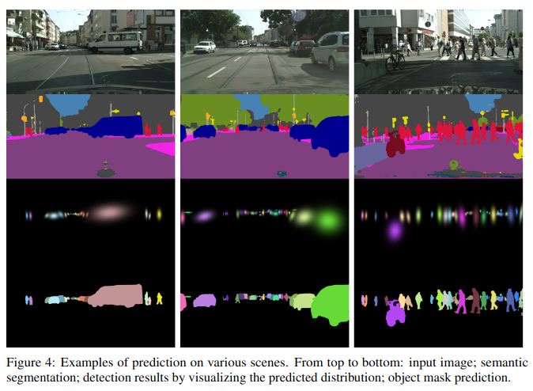
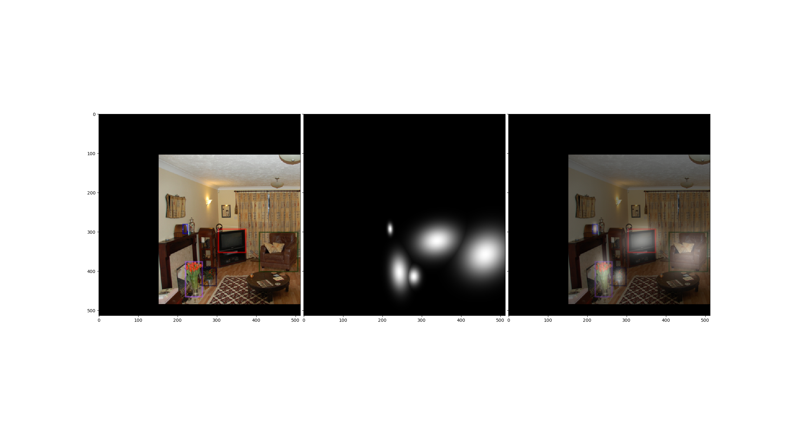
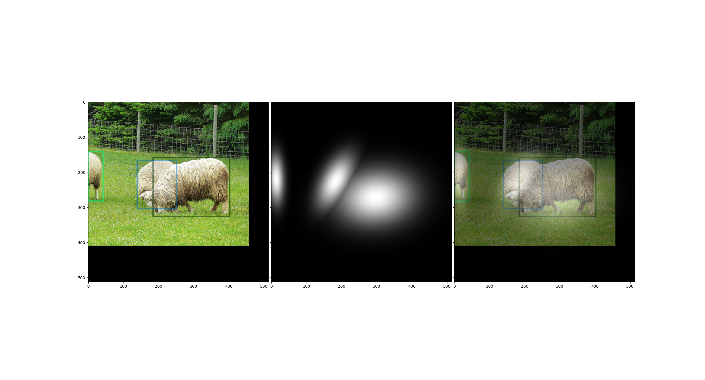
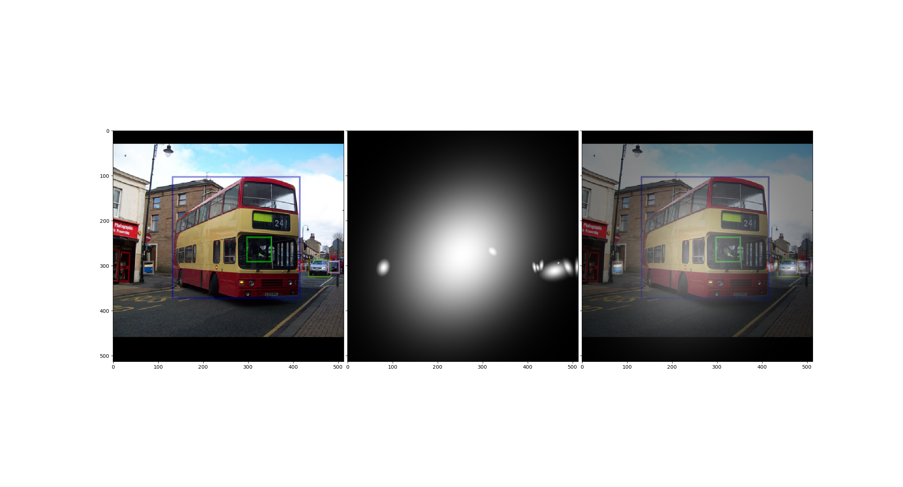

# Object-as-Distribution
Mobilepose-style implementation of object as distribution



**[Object As Distribution](https://arxiv.org/abs/1907.12929)** 

**[Mobilepose](https://arxiv.org/abs/2003.03522)**

# Project structure based on Detectron2

```
* Object-as-Distribution
  + configs
      + default_config.yaml
  - datasets(please add your repository of datasets)
      - coco
      - voc
      ...
  + sources
      + config.py
      ...
  + test.py
  
```

# Usage

```
python test.py --config configs/default_config.yaml --eval-only --num-gpus 2
```

# Demo



